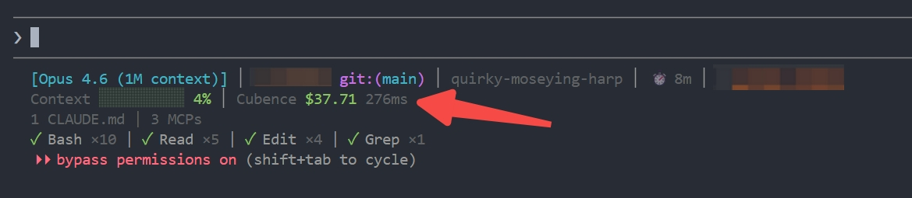

# Claude HUD Cubence

A fork of [jarrodwatts/claude-hud](https://github.com/jarrodwatts/claude-hud) with **Cubence balance and API latency display**.

[](LICENSE)
[](https://github.com/nangongwentian-fe/claude-hud-cubence/stargazers)



## What's New

Adds a **Cubence** segment to the context line, showing your account balance and API latency:

```
Context █░░░░░░░░░ 5% │ Cubence $12.34 230ms
```

With subscription:
```
Context █░░░░░░░░░ 5% │ Cubence 5h $1.23/$5.00 bal $12.34 230ms
```

- Reads `ANTHROPIC_AUTH_TOKEN` and `ANTHROPIC_BASE_URL` from `~/.claude/settings.json`
- Calls Cubence API `/v1/user/subscription-info` to fetch balance
- 180s file cache to avoid excessive API calls (statusline refreshes every ~300ms)
- API round-trip latency measured during balance fetch
- Graceful degradation: falls back to stale cache on API failure, hides if no token configured

## Install

Inside Claude Code, run:

**Step 1: Add the marketplace**
```
/plugin marketplace add nangongwentian-fe/claude-hud-cubence
```

**Step 2: Install the plugin**

<details>
<summary><strong>⚠️ Linux users: Click here first</strong></summary>

On Linux, `/tmp` is often a separate filesystem (tmpfs), which causes plugin installation to fail with:
```
EXDEV: cross-device link not permitted
```

**Fix**: Set TMPDIR before installing:
```bash
mkdir -p ~/.cache/tmp && TMPDIR=~/.cache/tmp claude
```

Then run the install command below in that session.

</details>

```
/plugin install claude-hud-cubence
```

**Step 3: Configure the statusline**
```
/claude-hud:setup
```

<details>
<summary><strong>⚠️ Windows users: Click here if setup says no JavaScript runtime was found</strong></summary>

Install Node.js LTS first:
```powershell
winget install OpenJS.NodeJS.LTS
```
Then restart your shell and run `/claude-hud:setup` again.

</details>

Done! Restart Claude Code to load the new statusLine config.

## Enable Cubence Balance

After installing, enable the Cubence display in your HUD config:

Edit `~/.claude/plugins/claude-hud-cubence/config.json`:

```json
{
  "display": {
    "showCubenceBalance": true
  }
}
```

Your `~/.claude/settings.json` must have the Cubence credentials:

```json
{
  "env": {
    "ANTHROPIC_AUTH_TOKEN": "your-cubence-api-key",
    "ANTHROPIC_BASE_URL": "https://api.cubence.com"
  }
}
```

---

## What is Claude HUD?

Claude HUD gives you better insights into what's happening in your Claude Code session.

| What You See | Why It Matters |
|--------------|----------------|
| **Project path** | Know which project you're in (configurable 1-3 directory levels) |
| **Context health** | Know exactly how full your context window is before it's too late |
| **Cubence balance** | Monitor your Cubence account balance and API latency in real-time |
| **Tool activity** | Watch Claude read, edit, and search files as it happens |
| **Agent tracking** | See which subagents are running and what they're doing |
| **Todo progress** | Track task completion in real-time |

## What You See

### Default (2 lines)
```
[Opus] │ my-project git:(main*)
Context █████░░░░░ 45% │ Cubence $12.34 230ms
```
- **Line 1** — Model, provider/auth label when relevant, project path, git branch
- **Line 2** — Context bar (green → yellow → red), Cubence balance and latency

### Optional lines (enable via `/claude-hud:configure`)
```
◐ Edit: auth.ts | ✓ Read ×3 | ✓ Grep ×2        ← Tools activity
◐ explore [haiku]: Finding auth code (2m 15s)    ← Agent status
▸ Fix authentication bug (2/5)                   ← Todo progress
```

---

## Configuration

Customize your HUD anytime:

```
/claude-hud:configure
```

### Options

All options from the original claude-hud are supported, plus:

| Option | Type | Default | Description |
|--------|------|---------|-------------|
| `display.showCubenceBalance` | boolean | false | Show Cubence account balance and API latency on the context line |

See the full option list in the original [claude-hud documentation](https://github.com/jarrodwatts/claude-hud#options).

### Example Configuration

```json
{
  "lineLayout": "expanded",
  "pathLevels": 2,
  "gitStatus": {
    "enabled": true,
    "showDirty": true
  },
  "display": {
    "showCubenceBalance": true,
    "showTools": true,
    "showAgents": true,
    "showTodos": true
  }
}
```

---

## Requirements

- Claude Code v1.0.80+
- Node.js 18+ or Bun
- Cubence account with API key (for balance display)

---

## Development

```bash
git clone https://github.com/nangongwentian-fe/claude-hud-cubence
cd claude-hud-cubence
npm ci && npm run build
npm test
```

---

## Credits

Forked from [jarrodwatts/claude-hud](https://github.com/jarrodwatts/claude-hud). Cubence balance implementation inspired by [@cubence/cubenceline](https://github.com/Cubence-com/CubenceLine).

## License

MIT — see [LICENSE](LICENSE)
